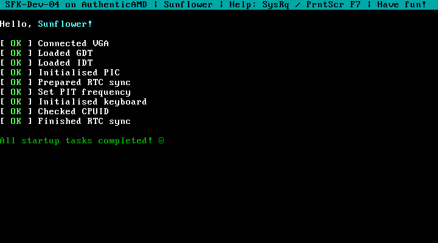

# Sunflower 🌻

Sunflower is a low scale kernel made by me just for fun. It usually manages to not crash most of the time <3

It's versioning system is a little strange, with new releases following 

`SFK-<version>-<version-name>-<patch>`

## Features
The latest version of Sunflower currently supports:
- reading from and writing to floppy drives, with a filesystem coming soon
- it's very own build tool, `seeder!`
- a really cool library called `libfs`
- a really boring library which needs major fixing called `libutil`
- basic screen printing using VGA Text Mode,
- a semi-basic PS/2 keyboard driver for drawing some of your cool ASCII art,
- some beeps and boops using the PC Speaker,
- a rudimentary 100 Hz timer and hardware clock reader,
- some [system commands](https://github.com/janicria/sunflower?tab=readme-ov-file#system-commands),
- a really cool test framework,
- and the most original crash screen there is

## Building
Sunflower uses it's very own build tool, `seeder`, which requires [`Rust`](https://www.rust-lang.org/tools/install) to be installed, and can be run via `cargo sdr`. 

Once you've installed rust you can just run the following commands to build a bootimage image of sunflower, which should appear at `sunflower.bin` 
```
git clone https://github.com/janicria/sunflower.git
cd sunflower
cargo sdr build
```

For more commands and options for `seeder`, you can just run `cargo sdr help`

```
Sunflower's build tool, seeder

Usage: cargo sdr COMMAND [OPTIONS]

Commands:
  build, b                    Builds the kernel
  run, r                      Builds then runs the kernel in QEMU, requires passing in an audio flag
  did-i-break-anything, diba  Runs tests on the kernel in QEMU
  clippy, c                   Checks sunflower using clippy
  dbg, d                      alias: run -dn
  help                        Print this message or the help of the given subcommand(s)

Options:
  -d, --debug        Enables runtime debug tools and information
  -e, --noenter      Prevents sunflower from detecting if the enter key is pressed
  -p, --path <FILE>  The file to write the built bootable disk image to
  -w, --pipewire     Run with pipewire audio support
  -a, --pulseaudio   Run with pulseaudio audio support
  -n, --nosound      Run without audio
  -h, --help         Print help
  -V, --version      Print version
```

## Running
### QEMU
Sunflower supports [`QEMU`](https://www.qemu.org/download/) for running the kernel in an emulator. After installing it, you can just run `cargo sdr run` with an audio flag 
```
cargo sdr run --nosound     # Run without audio 
cargo sdr run --pipewire    # Run with pipewire audio support
cargo sdr run --pulseaudio  # Run with pulseaudio audio support

```
If sunflower is ran in QEMU for the first time you may be promoted to format a floppy drive, this is just some file on your computer (`floppy.img`) and formatting it won't affect any physical floppy drives connected to your device.

With QEMU installed and the floppy drive formatted, you can also test sunflower by running: 
```
cargo sdr did-i-break-anything
````

### Real hardware
WARNING: Sunflower is not fully tested and may cause **damages** to your device if you try to run it on your device. I do not hold any responsibility for **anything** that may occur if you decide to do this, you are at your own risk.

However, if you'd like to run sunflower anyway on an x86 computer you can run:
```
cargo sdr build
sudo dd if=sunflower.bin of=/dev/DEVICE && sync
```
replacing `DEVICE` with the drive you want to write sunflower to (usually `sda` or `sdb` for USBs). This will **WIPE EVERYTHING** on that drive, so think before running the command and double check you put in the **right device name**.

You'll also need to enable the Legacy BIOS Boot option in your device's BIOS, and might have to change your boot order to boot into sunflower.

## System Commands

Sunflower supports a few builtin keyboard shortcuts, known as system commands. Hold either
`Ctrl+Alt+FX` or `SysRq+FX`, to run system command `X`. 

The `SysRq` key might be the same as `PrintScreen`on your keyboard. 


```
Ctrl+Alt+F1 / SysRq+F1 - Prints system information
Ctrl+Alt+F2 / SysRq+F2 - Clears the screen
Ctrl+Alt+F3 / SysRq+F3 - Beeps loudly
Ctrl+Alt+F4 / SysRq+F4 - Triggers a kernel panic
Ctrl+Alt+F5 / SysRq+F5 - Restarts the device
Ctrl+Alt+F6 / SysRq+F6 - Swap between text buffers
Ctrl+Alt+F7 / SysRq+F7 - Show help
```

## Screenshots




