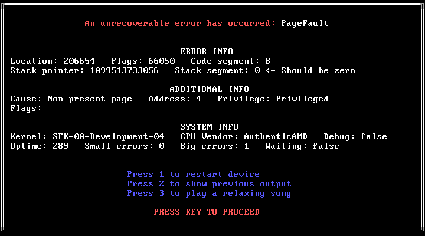

# Sunflower 🌻

Sunflower is a low scale kernel made by me just for fun. It usually manages to not crash most of the time <3

It's versioning system is a little strange, with new releases following 

`SFK-<version>-<version-name>-<patch>`

## Features
The latest version of Sunflower currently supports:
- basic screen printing using VGA Text Mode,
- a semi-basic PS/2 keyboard driver for drawing some of your cool ASCII art,
- some beeps and boops using the PC Speaker,
- a rudimentary 100 Hz timer and hardware clock reader,
- some [system commands](https://github.com/janicria/sunflower?tab=readme-ov-file#system-commands),
- a really cool test framework via `cargo did-i-break-anything`,
- and the coolest crash screen ever (it's even rainbow)

## Building
Sunflower requires [`Rust`](https://www.rust-lang.org/tools/install) to be installed before building, and once you've installed it you can just run:
```
git clone https://github.com/janicria/sunflower.git
cd sunflower
cargo install bootimage@0.10.3
cargo b
```
to build sunflower. The resulting disk image should appear at 
`target/x86_64-sunflower/release/bootimage-sunflower.bin`

## Running
### QEMU
Sunflower supports [`QEMU`](https://www.qemu.org/download/) for running it in a VM. After installing it you can just run either:
```
cargo run-nosound     # Run without audio 
cargo run-debug       # Run in debug mode without audio
cargo run-pipewire    # Run with pipewire audio support
cargo run-pulseaudio  # Run with pulseaudio audio support

```
to run sunflower with either no audio, pipewire support or  pulseaudio support respectively. With QEMU installed, you can also test sunflower by running: 
```
cargo did-i-break-anything
````

### Real hardware
WARNING: Sunflower is not fully tested and may cause **damages** or **permanent harm** to your device if you try to run in on your device. I do not hold any responsibility for **anything** that may occur if you decide to do this and you are at your own risk.

However, if you'd like to run sunflower anyway on an x86 compatible computer you can run:
```
sudo dd if=target/x86_64-sunflower/release/bootimage-sunflower.bin of=/dev/DEVICE && sync
```
replacing `DEVICE` with the USB you want to write sunflower to (usually `sda` or `sdb`). This will **WIPE EVERYTHING** on that drive, so think before running the command and double check you put in the **right device name**.

You'll also need to enable the Legacy BIOS Boot option in your device's BIOS, as well as maybe having to disable Secure Boot and changing your boot order.

## System Commands

Sunflower supports a few builtin keyboard shortcuts, known as system commands. Hold either
`Ctrl+Alt+FX` or `SysRq+FX`, to run system command `X`. 

The `SysRq` key might be the same as `PrintScreen`on your keyboard. 


```
Ctrl+Alt+F1 / SysRq+F1 - Prints system information
Ctrl+Alt+F2 / SysRq+F2 - Clears the screen
Ctrl+Alt+F3 / SysRq+F3 - Beeps loudly
Ctrl+Alt+F4 / SysRq+F4 - Crashes sunflower via rbod
Ctrl+Alt+F5 / SysRq+F5 - Restarts the device
Ctrl+Alt+F6 / SysRq+F6 - Swap between text buffers
Ctrl+Alt+F7 / SysRq+F7 - Show help
```

## Screenshots




